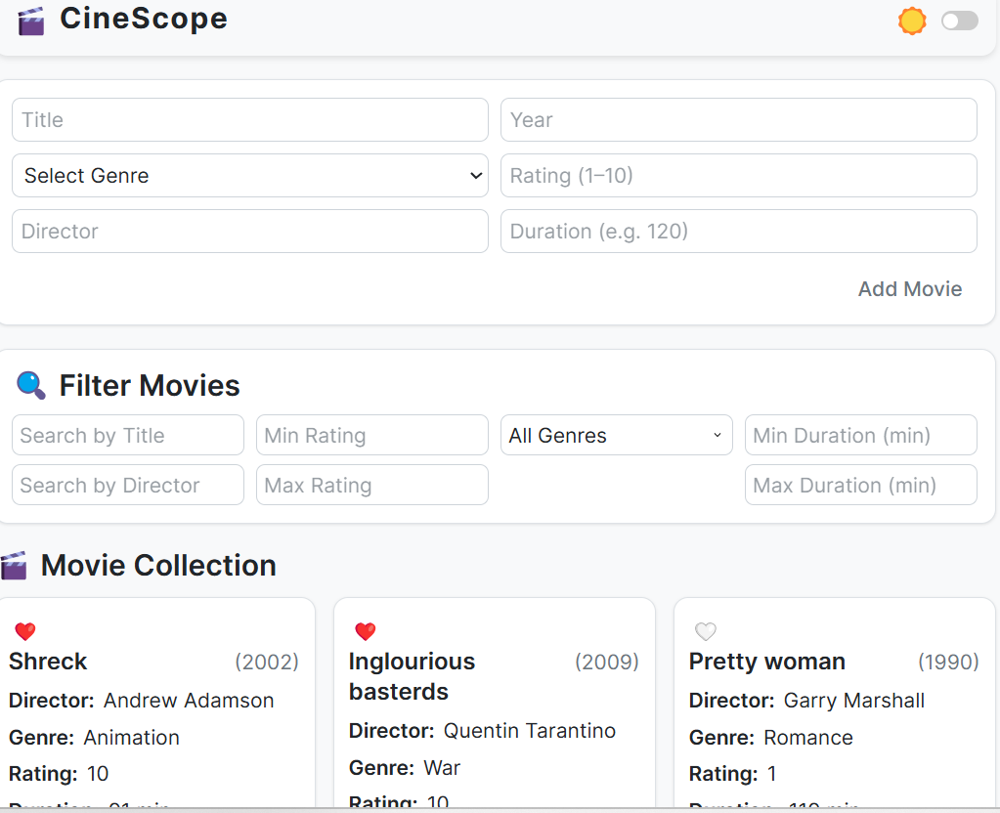
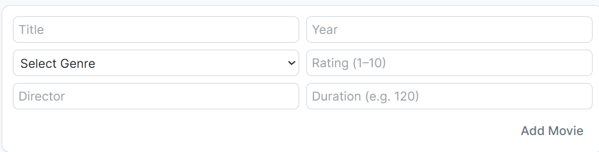
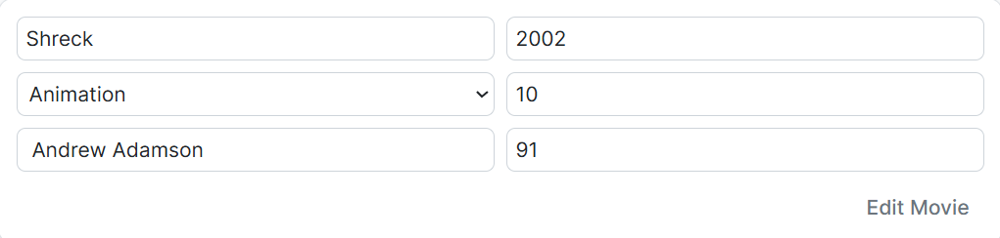
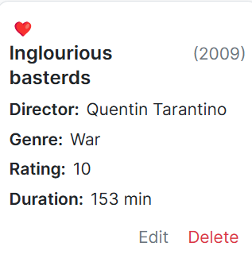
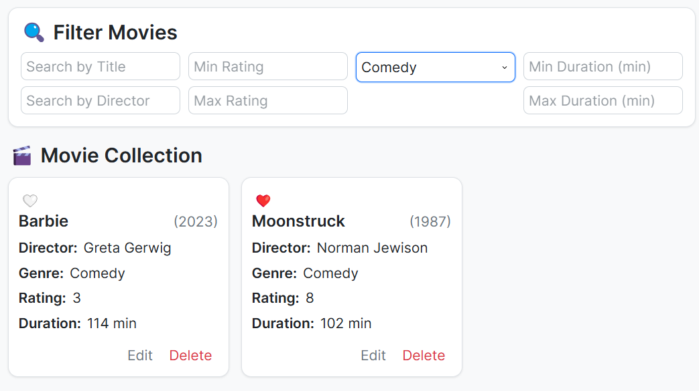
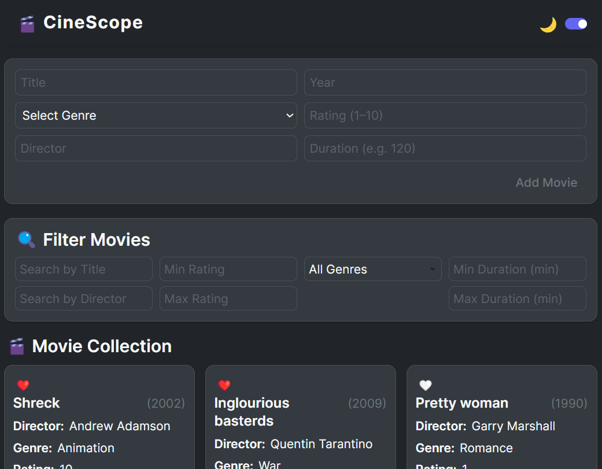

# CineScope

A movie agenda web app inspired by IMDb and Letterboxd. It combines the main functionalities of both apps. I took the functionalities which I use the most, i.e. this functionality is personalised for me🙃.

Users can:
- Add, edit, delete, and like movies
- Filter by rating, genre, duration, liked or not, title, and director
- Switch between light and dark themes

## Features

- Movie management: add/edit/remove your watched films
- Live filtering: by rating, genre, duration, title, or director
- Like system: mark your favorites
- Dark mode: toggle between light & dark themes
- Persistent storage: the app uses the browser’s local storage to persist user data between sessions.

## Implementation

The site is built with React and uses the tool Vite. It uses Tailwind CSS and some CSS Modules for styling. All movie data is stored in the browser using localStorage, so the list stays saved even after the user refreshes the page. 

## Screenshots and the flow of the app

1. ### Home / Initial View
   The user lands on the app and sees the header with the theme toggle, the movie form, filter options, and the list of previously added movies (if any are stored in localStorage).
   
   

2. ### Add a Movie  
   The user fills out the form with the movie's title, year, genre, rating, director, and duration. On submitting the form, the new movie appears in the list below.

   

3. ### Edit a Movie  
   Clicking the `Edit` button next to a movie populates its details back into the form. After making changes, the user can submit the form to update the movie in the list.

   

4. ### Delete a Movie  
   The `delete` button removes the selected movie from the list and from localStorage permanently.

   

5. ### Like / Unlike a Movie  
   Clicking the ❤️ icon toggles the movie’s liked status. This can later be used to filter favorite movies.

6. ### Filter Movies  
   Users can filter the movie list by rating, genre, duration, title, or director using the filter section. The movie list updates in real time as the user types or selects criteria.

   

7. ### Theme Toggle  
   The "Dark Mode" / "Light Mode" button in the header toggles the theme of the entire app, affecting colors and styling.

   

## Deployment
GitHub pages